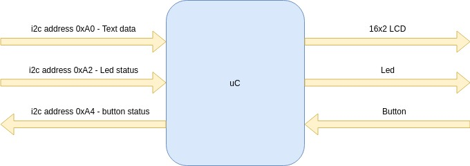
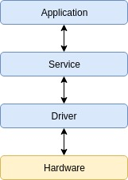
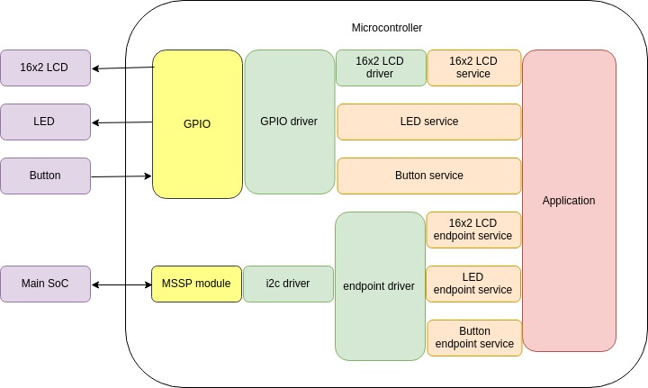
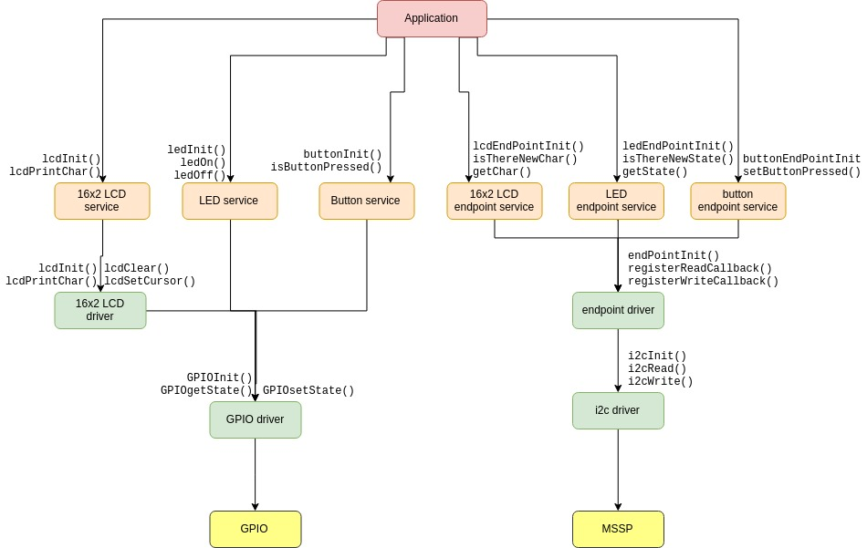

# Pre-project #

## Abstract ##

The goal of this project is to exercise the whole process of developing some application with a microcontroller. It should have a general description, a set of requirements (functional and non-functional), an architecture design, an interface design and the project itself (hardware, firmware, software design).

## Project description ##

The project consists of the firmware for a slave microcontroller of a SoC in a bigger system with a set of peripherals. The SoC running linux is the main processor of the system. The microcontroller is there to expand the amount of peripherals that the SoC could handle by controlling them under the control of the SoC. The system peripherals that will be responsability of the microcontroller are: a 16x2 aphanumeric LCD, a led and a button.

## Non functional requirements ##

 - The firmware pieces should be documented before or at the same time of implementation.
 - The firmware must be modular, easy to read and modify, divided in files organized by layers so the functions of one layer could be easily reused by several upper layers.
 - The microcontroller should comunicate with the SoC without add to much processing load to it.

## Functional requirements ##

 - The microcontroller must comunicate with the SoC using i2c.
 - Each funcionality should be a separate endpoint with it's own i2c address. The functionalities are:
    - Ascii Text written to the address 0xA0 should be print in the LCD.
    - The value written to the address 0xA2, if equal to zero, will turn off the led, otherwise, will turn on the led. 
    - The value read from the address 0xA4 will be 0x01 if the button have been pressed since the last time it was checked, and 0x00 otherwise.

As explained in [this article](https://www.embarcados.com.br/arquitetura-de-software-em-sistemas-embarcados/), the code will be divided in three layers. On the top is the "application" layer with higher abstraction level, on the middle is the "service" layer and the lowest level is the "driver" layer that talks directly to the hardware. Each layer talk to the others using function calls. The "driver" layer talks to the hardware by read and write to Special Function Registers.

The following diagram get deeper in the architecture:

And the following diagram get even deeper showing some of the main functions of each module:

